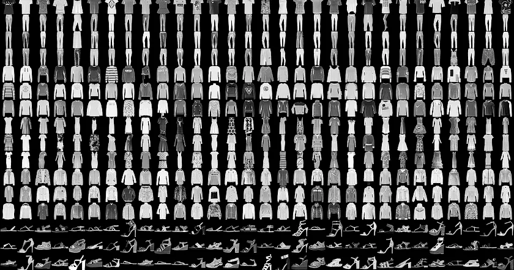

# Fashion MNIST Dress Classifier Neural Network

A neural network project that classifies clothing items from the Fashion MNIST dataset using TensorFlow and Keras.

## 📋 Project Overview

This project implements a deep learning model to classify 10 different types of clothing items from the Fashion MNIST dataset. The model uses a simple feedforward neural network architecture and demonstrates fundamental concepts in deep learning, including data preprocessing, model training, evaluation, and prediction.

## 🎯 Dataset

The project uses the **Fashion MNIST** dataset, which contains:



- 60,000 training images
- 10,000 test images
- 28x28 grayscale images
- 10 clothing categories:
  - 0: T-shirt/top
  - 1: Trouser
  - 2: Pullover
  - 3: Dress
  - 4: Coat
  - 5: Sandal
  - 6: Shirt
  - 7: Sneaker
  - 8: Bag
  - 9: Ankle boot

## 🏗️ Model Architecture

The neural network consists of three layers:

1. **Flatten Layer**: Converts 28x28 pixel images into a 1D array of 784 values
2. **Dense Hidden Layer**: 512 neurons with ReLU activation function
3. **Output Layer**: 10 neurons with Softmax activation function

### Activation Functions

- **ReLU (Rectified Linear Unit)**: Returns X if X > 0, else returns 0
- **Softmax**: Converts output values to probabilities that sum to 1.0, making the highest value the predicted class

## 🛠️ Technologies Used

- **TensorFlow**: Deep learning framework
- **Keras**: High-level neural networks API
- **Python**: Programming language
- **NumPy**: For numerical operations
- **Matplotlib**: For data visualization

## 📊 Model Training

- **Optimizer**: Adam
- **Loss Function**: Sparse Categorical Crossentropy
- **Metrics**: Accuracy
- **Epochs**: 5 (with optional early stopping callback)
- **Data Normalization**: Pixel values normalized from [0-255] to [0-1]

## 🚀 Getting Started

### Prerequisites

```bash
pip install tensorflow numpy matplotlib
```

### Running the Project

1. Open the Jupyter notebook: `dress_classification.ipynb`
2. Run all cells sequentially
3. The model will train on the Fashion MNIST dataset
4. View predictions and accuracy metrics

## 💡 Key Features

### 1. Data Preprocessing
- Loads Fashion MNIST dataset automatically
- Normalizes pixel values to improve training efficiency
- Splits data into training and test sets

### 2. Model Training
- Simple Sequential model architecture
- Efficient training with Adam optimizer
- Real-time accuracy monitoring

### 3. Model Evaluation
- Evaluates performance on test dataset
- Provides loss and accuracy metrics
- Makes predictions on unseen data

### 4. Early Stopping Callback
The project includes a custom callback to stop training when accuracy reaches 95%:

```python
class myCallback(tf.keras.callbacks.Callback):
  def on_epoch_end(self, epoch, logs={}):
    if(logs.get('accuracy')>0.95):
      print("\nReached 95% accuracy so cancelling training!")
      self.model.stop_training = True
```

## 🔬 Experiments and Exercises

The notebook includes several experiments to understand neural network behavior:

1. **Varying Neuron Count**: Testing different numbers of neurons in hidden layers (e.g., 512 vs 1024)
2. **Layer Removal**: Understanding the importance of the Flatten layer
3. **Output Layer Size**: Exploring the relationship between output neurons and classes
4. **Additional Layers**: Adding more hidden layers for complex patterns
5. **Normalization Impact**: Comparing results with and without data normalization
6. **Early Stopping**: Implementing callbacks to optimize training time

## 📈 Results

The model typically achieves:
- **Training Accuracy**: ~90-95% after 5 epochs
- **Test Accuracy**: ~85-90% on unseen data
- **Prediction Format**: Array of 10 probabilities for each class

### Example Prediction Output
```
[0.0001, 0.0002, 0.0003, 0.0004, 0.0005, 0.0006, 0.0007, 0.0008, 0.0009, 0.9950]
```
The highest probability (0.9950 at index 9) indicates the model predicts "Ankle boot" with 99.5% confidence.

## 📚 Learning Objectives

This project demonstrates:
- Building neural networks with Keras Sequential API
- Data preprocessing and normalization techniques
- Training and evaluating deep learning models
- Understanding activation functions
- Implementing custom callbacks
- Making predictions on new data
- Hyperparameter tuning and experimentation

## 🔍 Understanding the Code

### Why Normalization?
Normalizing pixel values from [0-255] to [0-1] helps:
- Speed up training
- Improve convergence
- Prevent gradient issues
- Achieve better accuracy

### Why These Layer Sizes?
- **Input**: 784 neurons (28x28 flattened)
- **Hidden**: 512 neurons (balance between complexity and performance)
- **Output**: 10 neurons (one for each clothing class)

## 🎓 Course Context

This project is part of the **Google Internship Course** materials, focusing on practical applications of neural networks in image classification tasks.

## 📝 Notes

- The model uses simple feedforward architecture (no CNNs)
- Data is automatically downloaded via Keras datasets
- Training times may vary based on hardware
- GPU acceleration recommended for faster training

## 🤝 Contributing

Feel free to experiment with:
- Different layer architectures
- Various activation functions
- Learning rate adjustments
- Additional epochs
- Data augmentation techniques

## 📄 License

This project is for educational purposes as part of the Google Internship course materials.

---

